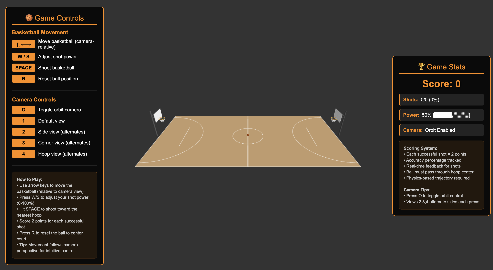
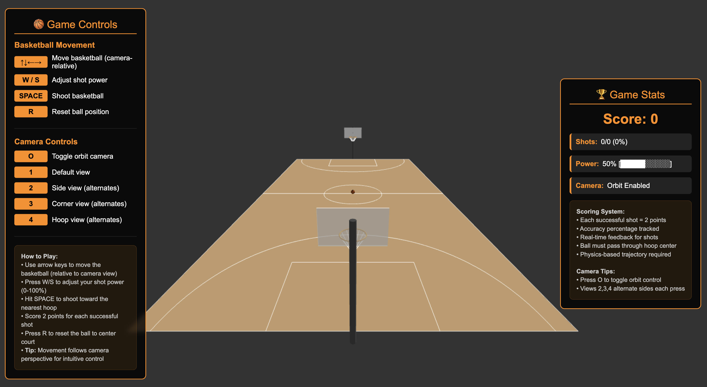
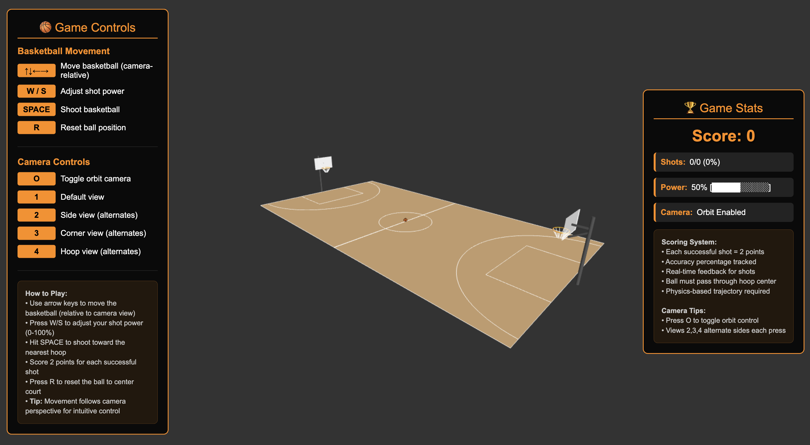
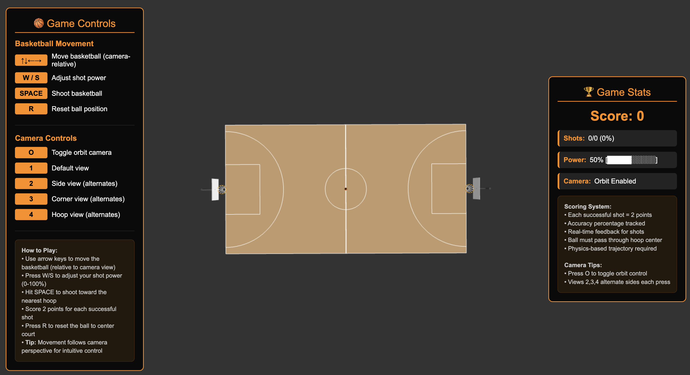
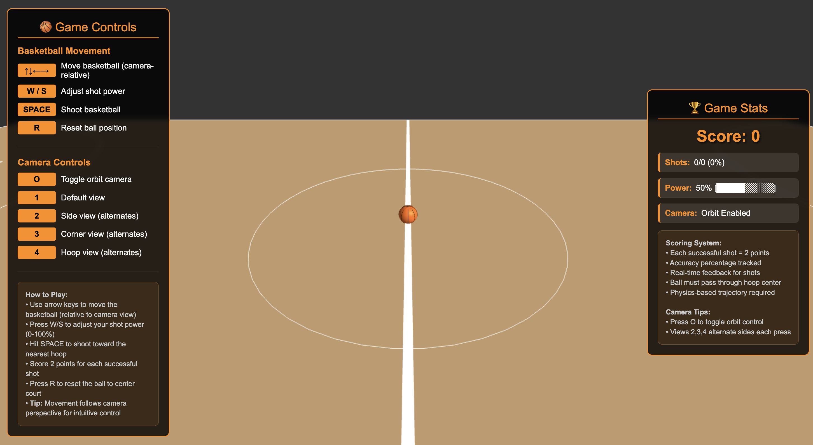
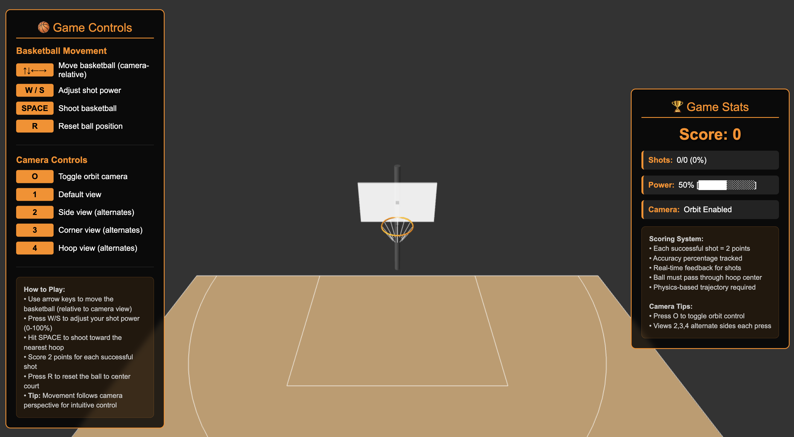
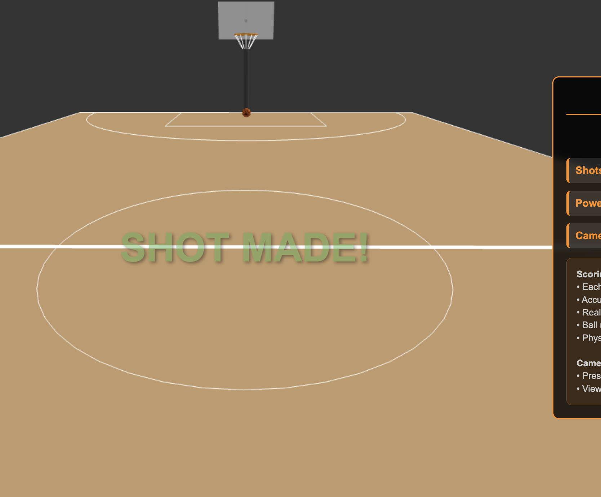
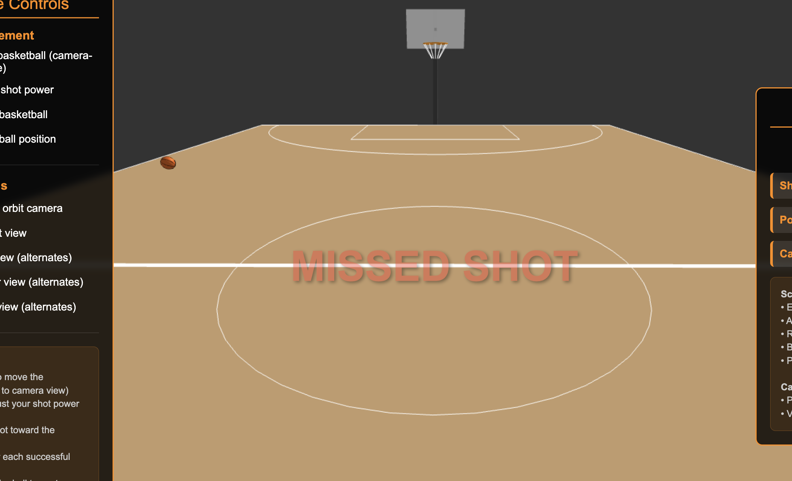

# Interactive Basketball Shooting Game - HW6

## Team Members
- Alon Regenbogen
- Tomer Leivy

## Overview
A fully interactive 3D basketball shooting game with realistic physics, scoring system, and intuitive controls. Built with Three.js, featuring a regulation-sized basketball court with authentic gameplay mechanics.

## How to Run
1. Install dependencies: `npm install`
2. Start the server: `node index.js`
3. Open your browser to `http://localhost:8000`
4. Use the controls shown in the left panel to play!

## Screenshots

### Court Views

*Default basketball court overview*

*Side perspective showing court dimensions*

*Angled corner view of the court*

*Top-down view of the entire court*

### Basketball and Hoops

*Basketball positioned at center court*

*Close-up view of basketball hoop*

### Gameplay Features

*Successful shot feedback message*

*Missed shot feedback message*

### Gameplay Video

*Complete gameplay demonstration*

## Main Features

### Basketball Controls
- **Arrow Keys (↑↓←→)**: Move basketball around the court (camera-relative movement)
- **W/S Keys**: Adjust shot power (0-100%) with real-time visual indicator
- **Spacebar**: Shoot basketball toward nearest hoop with physics-based trajectory
- **R Key**: Reset basketball to center court position

### Camera Controls
- **O Key**: Toggle orbit camera controls
- **1-4 Keys**: Camera presets (default, side, corner, hoop views)
- **Mouse Drag**: Free orbit camera when enabled
- **Side Views**: Automatically alternate between left/right perspectives

### Physics System
- **Realistic Gravity**: -9.8 m/s² affecting basketball trajectory
- **Ball Bouncing**: Energy loss on ground/boundary collisions
- **Projectile Motion**: Parabolic shooting arcs with proper physics
- **Collision Detection**: Precise scoring when ball passes through hoop center

### Scoring System
- **2 Points**: Per successful shot
- **Statistics Tracking**: Shot attempts, successful shots, and accuracy percentage
- **Visual Feedback**: "SHOT MADE!" / "MISSED SHOT" messages
- **Real-time Updates**: Score and statistics update immediately

### Basketball Animations
- **Movement Rotation**: Ball rotates based on movement direction and speed
- **Flight Rotation**: Realistic rotation during shooting and bouncing
- **Smooth Transitions**: All movements use time-based animations

## Complete List of Implemented Controls

### Basketball Movement Controls
| Control | Function | Implementation Details |
|---------|----------|------------------------|
| ↑ Arrow Key | Move Forward | Move basketball forward relative to camera view |
| ↓ Arrow Key | Move Backward | Move basketball backward relative to camera view |
| ← Arrow Key | Move Left | Move basketball left relative to camera view |
| → Arrow Key | Move Right | Move basketball right relative to camera view |
| W Key | Increase Power | Increase shot power (0-100%) with visual feedback |
| S Key | Decrease Power | Decrease shot power (0-100%) with visual feedback |
| Spacebar | Shoot Basketball | Launch ball toward nearest hoop with physics trajectory |
| R Key | Reset Ball | Return ball to center court, reset velocity and power |

### Camera Controls
| Control | Function | Implementation Details |
|---------|----------|------------------------|
| O Key | Toggle Orbit | Enable/disable mouse orbit camera controls |
| 1 Key | Default View | Standard court overview camera position |
| 2 Key | Side View | Alternating left/right sideline camera views |
| 3 Key | Corner View | Alternating corner perspective camera views |
| 4 Key | Hoop View | Alternating left/right hoop focus camera views |
| Mouse Drag | Free Orbit | 360° camera rotation when orbit mode enabled |

## Description of Physics System Implementation

### Gravity and Trajectory Physics
- **Gravity Constant**: -9.8 m/s² applied continuously to ball velocity
- **Parabolic Motion**: Physics-based projectile motion using kinematic equations
- **Launch Angle Calculation**: Optimal basketball shooting angle (45-50°) with power variation
- **Velocity Components**: X, Y, Z velocity vectors calculated from launch angle and power
- **Arc Height**: Realistic basketball trajectory ensuring proper clearance over rim

### Collision Detection System
- **Ground Collision**: Ball bounces when Y position ≤ ground level (0.15m)
- **Energy Loss**: 70% velocity retention on each bounce (coefficient of restitution = 0.7)
- **Boundary Collision**: Ball bounces off court edges with energy loss
- **Rim Detection**: Precise scoring requires ball passage through hoop center within 80% rim radius
- **Trajectory Validation**: Successful shots must have downward velocity (proper arc)

### Ball Physics Mechanics
- **Time-Based Physics**: All calculations use deltaTime for frame-rate independent motion
- **Velocity Damping**: Ball comes to rest when velocity drops below threshold (0.5 m/s)
- **Rotation Physics**: Ball rotation speed proportional to movement velocity
- **Multi-Axis Rotation**: Separate X and Z rotation based on movement direction
- **Smooth Transitions**: Continuous velocity updates create realistic ball movement

### Shot Mechanics Implementation
- **Power System**: 0-100% power affects initial velocity (70%-150% speed range)
- **Distance Calculation**: Automatic distance measurement to nearest hoop
- **Trajectory Optimization**: Physics equations solve for required velocity to reach target
- **Automatic Targeting**: Ball shoots toward closest basketball hoop
- **Arc Validation**: Minimum height requirement ensures ball clears rim for scoring

## Court Specifications
- **Court Size**: 28m x 15m (regulation basketball court dimensions)
- **Basketball**: Enhanced size for better visibility
- **Hoop Height**: 3.05 meters (10 feet) - regulation height
- **Enhanced Shooting Power**: Realistic long-distance shot capability

## Key Gameplay Features
- **Camera-Relative Movement**: Arrow keys move ball relative to current camera view
- **Automatic Targeting**: Shoots toward nearest basketball hoop
- **Power-Based Shooting**: Shot strength affects trajectory and distance
- **Boundary Protection**: Ball stays within court boundaries
- **Professional UI**: Real-time statistics and control instructions

## Development 
- Physics-based basketball movement with realistic gravity
- Interactive controls for movement, shooting, and power adjustment
- Basketball rotation animations matching movement direction
- Comprehensive scoring system with statistics tracking
- Enhanced user interface with real-time feedback
- Professional visual effects and smooth gameplay
